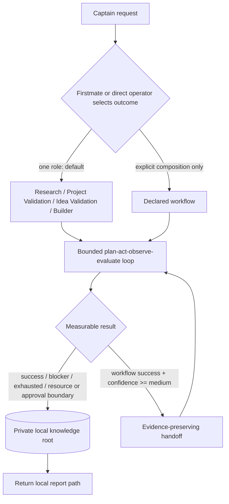

# AI Company OS

AI Company OS is a small, standalone foundation for four independently callable roles: **Research**, **Project Validation**, **Idea Validation**, and **Builder**. Independent invocation is the default. A conceptual sequence never causes hidden prerequisite or downstream work; multiple roles run only when the assignment explicitly selects a declared workflow.

The foundation provides real routing, private persistence, JSON validation, bounded run-state recording, policy gates, and confidence-gated handoffs. Model execution is an explicit adapter boundary, so Firstmate - or any direct operator - can supervise a worker without changes to Firstmate core.

## Setup

The core requires Python 3.10+ and Git. The optional Pi dashboard package requires Node.js 20+ and Pi. Both surfaces use standard-library code and add no third-party runtime or development package dependencies.

```sh
git clone https://github.com/ChiiKang/ai-company-os.git
cd ai-company-os
./scripts/test.sh
./bin/ai-company-os init
```

The executable sets project-local `PYTHONPATH`; it installs nothing globally. If an editable install is useful, keep it local:

```sh
python3 -m venv .venv
.venv/bin/python -m pip install -e .
```

Set `AI_COMPANY_OS_KNOWLEDGE_ROOT` or pass global `--root PATH` to choose private storage. The default is `~/.local/share/ai-company-os`.

## Architecture

```text
roles/          public role contracts
procedures/     reusable intake, evidence, planning, design, integration, acceptance
workflows/      optional explicit compositions, loaded at runtime as the only workflow authority
schemas/        strict standard JSON Schema assignment, workflow, and artifact contracts
docs/           stable integration contracts and dashboard operations guide
src/            policy, routing, loop, validation, private storage, vault boundary
extensions/     distributable Pi dashboard extension and built-in localhost UI
bin/            standalone CLI
scripts/        reproducible tests, generated schema enum sync, public-safety check, dashboard dev runner
tests/          Python workflows plus Node dashboard integration tests
```



`run start` first performs deterministic lexical retrieval over private metadata (titles, tags, summaries, claims, decisions, and experiment outcomes). It returns a bounded `What we already know` block with stable `local://` references and warnings for related failed reproductions/rejected decisions, plus only the selected `current_role`, public `role_definition_path`, and explicit model adapter boundary. Semantic search is a later enhancement. `run event` records the bounded loop. A successful workflow step waits for a valid `run handoff`; it never silently starts another role.

## Assignment contract

Every run validates `ai-company.assignment.v1` before execution. The strict schema includes the one initial role, an optional explicitly selected workflow, measurable goal and success criteria, constraints, composite budget, prior-knowledge query/references, narrow approval pre-grants, assignment-specific output path beneath the private root, and source/environment/artifact recovery identities. The CLI creates this file; unknown fields and unsafe output paths fail validation.

## Privacy model

The GitHub repository is public and contains only reusable definitions, contracts, code, and generic tests. **Every captain-specific assignment, idea, report, experiment, artifact, and decision stays in the private knowledge root.**

The store:

- resolves the knowledge root and rejects the public repository or any child path;
- creates it lazily as `0700` and files as `0600`;
- accepts report/artifact source files only from outside the public repository;
- rejects raw secret-like content and never emits report bodies from store commands;
- requires its private-artifact marker near the top of every stored report, which the safety scan rejects if staged;
- stores report Markdown beside searchable structured metadata;
- is reinforced by `.gitignore` and `scripts/check-public-safety.py`.

Do not create a captain report in this clone even temporarily. Create it under the private root or another private external directory, then use `artifact store`. The command returns `local_report_path`.

## Independent role examples

Every assignment records a requested outcome, measurable goal, metric, target, criteria, and resource policy. Values below are generic shell examples; real captain text is persisted outside this repository.

### Research

```sh
./bin/ai-company-os assignment create \
  --role research --title "Bounded topic" \
  --outcome "A current cited teaching report" \
  --goal "Explain the selected mechanism and trade-offs" \
  --metric "required evidence-backed sections" --target "6 of 6" \
  --criterion "dated primary sources" --criterion "explicit uncertainty"
```

Research defaults to 120 minutes and begins with one bounded intake questionnaire; it does not repeatedly interview the captain.

### Project Validation

```sh
./bin/ai-company-os assignment create \
  --role project-validation --title "Claim reproduction" \
  --outcome "A reproducible verdict for ranked claims" \
  --goal "Test the selected claims without changing the supplied source" \
  --metric "claims with baseline and disconfirming test" --target "all selected claims" \
  --criterion "isolated environment" --criterion "raw evidence and exact commands" \
  --source-identity "sha256:SUPPLIED_SOURCE_DIGEST" \
  --environment-identity "container-image:PINNED_DIGEST"
```

Project Validation defaults to 240 minutes. It starts with a feasibility pre-check, tests one to five claims in an isolated copy/environment, and keeps the supplied original immutable. `could not attempt` means execution never passed feasibility/approval; `could not reproduce` requires evidence from an actual attempt.

### Idea Validation

```sh
./bin/ai-company-os assignment create \
  --role idea-validation --title "Market decision" \
  --outcome "An evidence-driven proceed/modify/test further/reject recommendation" \
  --goal "Reduce uncertainty in customer, competition, price, and distribution" \
  --metric "decision-sensitive assumptions tested" --target "top 5" \
  --criterion "cheapest next experiment" --criterion "demand evidence labeled honestly"
```

Idea Validation defaults to 120 minutes. Desk research can challenge an idea but cannot prove demand.

### Builder

```sh
./bin/ai-company-os assignment create \
  --role builder --title "Approved prototype" \
  --outcome "A tested end-to-end acceptance demonstration" \
  --goal "Meet the approved prototype criteria" \
  --metric "acceptance criteria demonstrated" --target "all required criteria" \
  --criterion "integrated user journey" --criterion "automated tests" \
  --budget-minutes 360 --approved-plan-id plan-approved-001
```

Builder has no guessed default: its budget must come from an approved plan. Direct Builder invocation is valid when building is the requested outcome; it does not silently run another role.

Start any returned assignment independently:

```sh
./bin/ai-company-os run start --assignment asn_RETURNED_ID
```

## Explicit composed workflow

```sh
./bin/ai-company-os assignment create \
  --workflow research-to-idea-validation --title "Explicit combined decision" \
  --outcome "Teach the domain, then critique the assigned idea" \
  --goal "Reach a cited recommendation within the original scope" \
  --metric "workflow criteria met" --target "both role criteria" \
  --criterion "research evidence" --criterion "idea recommendation"
```

Available workflows are `research-to-idea-validation`, `research-to-project-validation`, and `project-validation-to-builder`. Each one is defined only by its `workflows/<name>.json` contract, validated against `schemas/workflow.schema.json` and loaded at runtime; the code holds no second copy, so adding or editing a contract file changes routing, the accepted CLI selections, and the handoff confidence floor. Any workflow containing Project Validation requires explicit `--source-identity` and `--environment-identity`; the Builder workflow additionally requires `--builder-budget-minutes` and `--approved-plan-id`.

An automatic handoff is accepted only after current-role measurable success, within the original workflow route, at the confidence floor declared by the workflow contract (`medium` or `high`), with evidence references, provenance hashes, and uncertainty. Every load-bearing claim must independently meet the declared claim floor with linked evidence; unsupported numeric self-scoring fails. The rubric is in `procedures/confidence.md`. Each field the contract lists under `automatic_handoff.preserve` must be present and is carried forward: preserved evidence and provenance become part of the run's immutable artifact identity, and preserved uncertainty is returned as `carried_uncertainty` for the downstream role.

Handoffs never approve what the contract lists in `handoff_never_approves` (spending, sensitive access, destructive behavior, production deployment, unrequested product construction). Any triggered approval boundary blocks the handoff, and once a run has advanced automatically, an assignment pre-grant in a never-approved category is no longer applied implicitly; the downstream event must carry the captain's approval identifier.

## Artifacts and reports

Contracts are in `schemas/` for assignments, claims/evidence, experiments, handoffs, and decision reports.

```sh
./bin/ai-company-os artifact validate --type experiment --file /private/path/experiment.json
./bin/ai-company-os artifact store --type decision-report \
  --file /private/path/decision.json --report /private/path/report.md
./bin/ai-company-os artifact search --assignment asn_RETURNED_ID
```

Decision reports are readable Markdown with Mermaid; metadata enables validation and search without loading report bodies. Run `artifact marker` to get the mandatory first-five-lines private marker without importing Python internals. Role-specific evidence and verdict rules live in `roles/` and `procedures/`.

## Composite resources, checkpoint, and recovery

Each phase accounts for wall-clock minutes, model tokens, monetary cost, tool calls, and download bytes. The first ceiling stops work. Unknown usage remains `unknown` and stops - it is not treated as free. Paid usage defaults to zero until a positive monetary ceiling and operation approval are recorded. Role wall-clock defaults remain 120/240/120 minutes; Builder derives its ceiling from an approved plan.

Each phase is atomically checkpointed. `run inspect --run ID` verifies state and assignment identity. A workflow run additionally binds the selected contract's version, digest, route, and confidence floors into that identity, so editing the contract file mid-run stops execution instead of silently changing its gates; `run inspect` stays read-only and keeps working, reporting the stored and current contract identity, whether the current contract is `changed`, `missing`, or `unloadable`, and a drift warning; a deleted or invalid contract is diagnosed rather than hidden behind a load error. After interruption, `run resume --run ID --attestation /private/recovery.json` compares checkpoint, source, environment, approval, and immutable artifact identities before continuing; it cannot revive a terminal/resource-exhausted run. A changed workflow contract resumes only when the attestation adds a `workflow_contract_migration` object naming the captain's `approval_id` and both the stored and current contract version/digest, and only when the workflow identity and route are unchanged and no confidence floor is lowered.

## Boundaries, hostile code, and secrets

The loop ends at measurable success, a proven blocker, exhausted useful hypotheses, a resource limit, or an approval boundary. Ask the captain before paid APIs, cloud resources, downloads over 5 GB, protected credential access, security-sensitive operations, destructive actions, hazardous physical procedures, or production deployment. Cross-industry work defaults to literature, simulation, public datasets, and safe software. AI Company OS never autonomously executes wet-lab, chemical, biological, manufacturing-equipment, hazardous physical, or industrial-control procedures.

Clones and dependencies are hostile. Acquire them without execution in a separate credential-free, destination-allowlisted staging step. The execution envelope is offline by default, credentialless, unprivileged, without home/knowledge mounts or the host container socket, resource-bounded, and limited to a scratch output mount. A separately approved measured network behavior is the only network exception. Validate a JSON envelope with `sandbox validate --file /private/sandbox.json --allowed-staging-root /private/staging`; see `procedures/untrusted-code.md`.

Protected credentials use only the Automic Vault name boundary. Accepted names include `OPENAI_API_KEY`, `ANTHROPIC_API_KEY`, and `GITHUB_TOKEN`; never provide values to this app. `av` may be in an application bundle rather than `PATH`:

```sh
export AUTOMIC_VAULT_CLI=/path/to/av
./bin/ai-company-os vault locate
# After separate captain approval, the adapter boundary is:
# av inject OPENAI_API_KEY -- approved-command
```

AI Company OS never gets, stores, logs, echoes, or asks for the raw value.

## Read-only AI Company dashboard

This repository is also a discoverable Pi package. After the dashboard change is merged, install it directly from GitHub:

```sh
pi install git:github.com/ChiiKang/ai-company-os
```

Set `FM_HOME` to the Firstmate operational home, start Pi, and run `/aidashboard`. When the operational home and tracked Firstmate code root differ, also set `FM_ROOT_OVERRIDE` so the dashboard can call the authoritative `bin/fm-crew-state.sh <id>` reader. The command starts or reuses one `127.0.0.1` server, opens the default browser, reports the URL, and releases session-owned resources when Pi shuts down.

The dashboard is read-only and sanitized. Flowline is the default planning view, Operations Constellation maps live tasks to real workstreams, and Event Ledger labels status entries as history rather than current truth. One SSE bridge carries bounded updates to every panel; there are no per-panel polling loops. See [`docs/ai-dashboard.md`](docs/ai-dashboard.md) for configuration, security, resource ceilings, and troubleshooting, and [`docs/ai-dashboard-performance.md`](docs/ai-dashboard-performance.md) for measured evidence.

## Firstmate contract

[`docs/firstmate-integration-v1.md`](docs/firstmate-integration-v1.md) defines the stable JSON CLI/file boundary. Firstmate routes natural language to exactly one role or an explicitly requested workflow, supervises approval identifiers and model execution, stores artifacts, and returns the local report path. The CLI remains fully independent of Firstmate.

## Development

```sh
./scripts/test.sh
```

This runs Python `unittest`, the Node dashboard tests, and the public-safety scan. No global package changes are required. The same command is the whole CI job in `.github/workflows/ci.yml`, which runs on every pull request and on pushes to `main` against Python 3.10 and 3.12 with Node 20, so the supported floors above are exercised and not just claimed. Public changes must pass automated review/tests, use a pull request, and wait for captain approval; do not merge without it.
